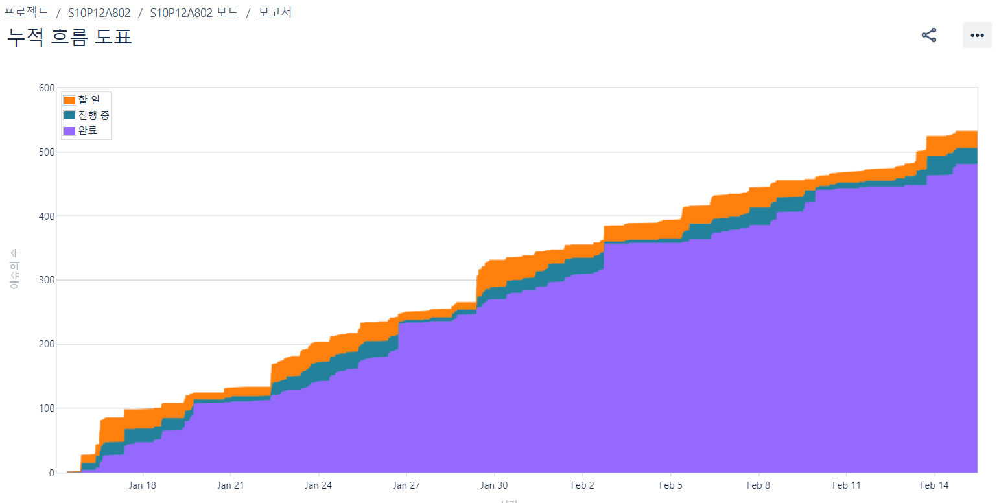

<div align="center">
  <br />
  
  <br />
  <h1>실시간 축구 시청 화상 모임 플랫폼</h1>
  <br />
</div>
<div>

</div>
<hr>

## 목차

1. [**서비스 소개**](#1)
2. [**기술 스택**](#2)
3. [**시스템 아키텍처**](#3)
4. [**주요기능 소개**](#4)
5. [**UCC 보러가기**](#5)
6. [**협업 관리**](#6)
7. [**개발 멤버 소개**](#7)
8. [**프로젝트 기간**](#8)
9. [**프로젝트 관련 문서**](#9)
10. [**참고**](#10)

<br/>

<div id="1"></div>

## 💡 서비스 소개

### 👥 친구들과 함께 축구 경기를 📺 시청하고, 🗳️ 응원하고, ⚽️ 경기 정보를 받아보세요!

온라인에서 소그룹 별 축구 화상 응원과 경기 정보 제공 서비스를 제공합니다.  
단순히 경기를 함께 시청하고 응원하는 것뿐만 아니라 실시간 축구 정보 제공, 촬영 기능 등 다양한 부가기능도 함께 제공합니다.

#### SPOPARTY에서 새로운 축구 시청을 경험해보세요!

<br/>

<div id="2"></div>

## 🛠️ 기술 스택

    <br>
    <br>
   <br>
  <br/>

<h3><details><summary><b> 상세 기술스택 및 버전 </b> </summary>

| 구분       | 기술스택            | 상세내용               | 버전      |
|----------|-----------------|--------------------|---------|
| 공통       | 형상관리            | Gitlab             | \-      |
|          | 이슈관리            | Jira               | \-      |
|          | 커뮤니케이션          | Mattermost, Notion | \-      |
| BackEnd  | DB              | MariaDB            | 10.3.23 |
|          |                 | JPA                | \-      |
|          |                 | QueryDSL           | 5.0.0   |
|          |                 | Redis              | 7.2.4   |
|          | Java            | Correto-17         | 17.0.10 |
|          | Spring          | Spring             |         |
|          |                 | Spring Boot        | 3.0.0   |
|          | IDE             | IntelliJ           |         |
|          | Cloud Storage   | AWS S3             | \-      |
|          | Build           | Gradle             | 7.4     |
|          | WebRTC          | OpenVidu           | 2.29.0  |
|          | API Docs        | Postman            |         |
| FrontEnd | HTML5           |                    | \-      |
|          | CSS3            |                    | \-      |
|          | JavaScript(ES6) |                    | \-      |
|          | Vue.js          | Vue.js             | 3.4.15  |
|          | WebSocket       |                    |         |
|          | IDE             | Visual Studio Code |         |
| Server   | 서버              | AWS EC2            | \-      |
|          | 플랫폼             | Ubuntu             |         |
|          | 배포              | Docker             |         |
|          | 배포              | Jenkins            |         |

</details>

<br />

<div id="3"></div>

## 🗂️ 시스템 아키텍처

|                 시스템 구성                  |
|:---------------------------------------:|
|  |

|              CI/CD 배포 흐름도               |
|:---------------------------------------:|
|  |

| 디렉토리 구조 |
|:-------:|

```
Project
├─backend
│  ├─gradle
│  └─src
│      ├─main
│      │  ├─generated
│      │  │  └─com
│      │  │      └─spoparty
│      │  │          └─api
│      │  │              ├─common
│      │  │              │  └─entity
│      │  │              └─member
│      │  │                  └─entity
│      │  ├─java
│      │  │  └─com
│      │  │      └─spoparty
│      │  │          ├─api
│      │  │          │  ├─archive
│      │  │          │  │  ├─controller
│      │  │          │  │  ├─entity
│      │  │          │  │  ├─repository
│      │  │          │  │  └─service
│      │  │          │  ├─board
│      │  │          │  │  ├─controller
│      │  │          │  │  ├─entity
│      │  │          │  │  ├─repository
│      │  │          │  │  └─service
│      │  │          │  ├─club
│      │  │          │  │  ├─controller
│      │  │          │  │  ├─dto
│      │  │          │  │  │  ├─request
│      │  │          │  │  │  └─response
│      │  │          │  │  ├─entity
│      │  │          │  │  ├─repository
│      │  │          │  │  │  └─querydsl
│      │  │          │  │  └─service
│      │  │          │  ├─common
│      │  │          │  │  ├─constants
│      │  │          │  │  ├─dto
│      │  │          │  │  ├─entity
│      │  │          │  │  └─exception
│      │  │          │  ├─football
│      │  │          │  │  ├─controller
│      │  │          │  │  │  └─test
│      │  │          │  │  ├─entity
│      │  │          │  │  ├─repository
│      │  │          │  │  │  └─querydsl
│      │  │          │  │  ├─response
│      │  │          │  │  │  └─comparator
│      │  │          │  │  └─service
│      │  │          │  ├─member
│      │  │          │  │  ├─controller
│      │  │          │  │  ├─entity
│      │  │          │  │  ├─repository
│      │  │          │  │  └─service
│      │  │          │  ├─openvidu
│      │  │          │  ├─party
│      │  │          │  │  ├─controller
│      │  │          │  │  ├─dto
│      │  │          │  │  │  ├─request
│      │  │          │  │  │  └─response
│      │  │          │  │  ├─entity
│      │  │          │  │  ├─repository
│      │  │          │  │  └─service
│      │  │          │  └─vote
│      │  │          │      ├─controller
│      │  │          │      ├─domain
│      │  │          │      ├─dto
│      │  │          │      │  ├─request
│      │  │          │      │  └─response
│      │  │          │      ├─repository
│      │  │          │      └─service
│      │  │          ├─common
│      │  │          │  ├─interceptor
│      │  │          │  ├─model
│      │  │          │  │  └─response
│      │  │          │  └─util
│      │  │          ├─config
│      │  │          ├─redis
│      │  │          └─security
│      │  │              ├─exception
│      │  │              ├─jwt
│      │  │              ├─model
│      │  │              └─service
│      │  └─resources
│      └─test
│          └─java
│              └─com
│                  └─spoparty
│                      └─api
│                          ├─club
│                          │  └─service
│                          └─vote
│                              └─service
├─batch
│  ├─gradle
│  └─src
│      ├─main
│      │  ├─java
│      │  │  └─com
│      │  │      └─spoparty
│      │  │          └─batch
│      │  │              ├─dto
│      │  │              ├─dummyData
│      │  │              │  └─model
│      │  │              ├─entity
│      │  │              ├─Exception
│      │  │              ├─job
│      │  │              ├─repository
│      │  │              ├─scheduler
│      │  │              │  └─model
│      │  │              ├─step
│      │  │              └─util
│      │  └─resources
│      └─test
│          └─java
│              └─com
│                  └─spoparty
│                      └─batch
├─frontend
│  ├─public
│  └─src
│      ├─api
│      ├─components
│      │  ├─archive
│      │  ├─board
│      │  ├─club
│      │  ├─common
│      │  ├─league
│      │  ├─mainpage
│      │  ├─match
│      │  ├─openvidu
│      │  ├─party
│      │  ├─user
│      │  └─vote
│      ├─router
│      ├─stores
│      │  ├─club
│      │  │  └─party
│      │  ├─football
│      │  └─member
│      ├─util
│      └─views
├─jenkins
└─nginx
```

<br/>

|                ERD                 |
|:----------------------------------:|
|  |
|    |
|   |

<br />

<div id="4"></div>

## 🖥️ 주요기능

### Private 클럽 생성 및 초대

- 친한 친구들과 축구 경기를 즐기고, 추억을 간직하고 싶으시다고요? 비공개 클럽을 만들고 초대해보세요!<br/>
  

### 축구 시청 파티 생성

- 클럽멤버들과 축구 시청을 위한 파티를 만들어 함께 응원해 보아요!
- 실시간 경기 URL과 경기 정보를 입력하면, 친구들과 함께 같은 경기를 시청할 수 있어요.
- 캠과 오디오, 채팅창을 통해 친구들과 소통할 수 있어요.<br/>
  

### 파티 내 오락거리

#### 투표

- 10분 뒤에 저 선수가 골을 넣을 수 있을지, 없을지. 내가 응원하는 팀이 전반전 동안 우세를 점할지, 골 점유율은 어떻게 될지. 미래를 점치면서 경기를 즐겨보아요!
- 예측이 틀렸으면? 어딜가려고 해요? 이리와서 벌칙 받아요! 투표 결과에 따라 다양한 벌칙을 받을 수 있어요<br/>
  

#### 사진/영상 촬영

- 추억은 아름다운 기억! 안타까운 시간을 흘러보내기만 할 건가요?
- 다시 돌아오지 않을 이 순간을 귀중하게 간직한다면 어떨까요?
- 지나고 돌이켜보면 아름다운 추억의 오아시스가 될 순간을 기록해보아요!
- 촬영물은 추억 아카이브에서 2주간 다운받을 수 있어요.<br/>
  

#### 실시간 경기 정보 제공

- 저 선수 이름이 뭐였지?
- TV보다가 문득 저 선수가 누군지 궁금하지 않으셨나요?
- 원클릭으로 경기 실황을 한 번에 알아보아요!<br/>
  

### 축구 정보 제공

- 다른 사이트 찾아가지 마세요! 다양한 축구 정보를 우리 사이트에서는 무료로 제공합니다!
- 내가 팔로우 하고 있는 팀 경기를 놓치지 않도록 알림을 제공합니다!<br/>
  
  

### 응원 집계 현황

- 다른 사람들은 누굴 응원할까? 응원 집계 현황을 실시간으로 즐겨보아요!<br/>
  

<br/>

<div id="5"></div>

## 🎥 [UCC 보러가기](https://www.notion.so/e0b09d6347bd497ba8d98f75ce2efb9c)

<br />

<div id="6"></div>

## 👥 협업 관리

|                   Jira 누적흐름 다이어그램                    |
|:----------------------------------------------------:|
|  |

| <a href="https://www.notion.so/6D-project-a6f5e07de61549f5a099f038e14be080">Notion</a> |
|:--------------------------------------------------------------------------------------:|
|                                               |

<br />

<div id="7"></div>

## 👪 개발 멤버 소개

<table>
    <tr>
        <td height="140px" align="center"> <a href="https://github.com/gogoadl">
             <br><br> 👑 박현우 <br>(Back-End) </a> <br></td>
        <td height="140px" align="center"> <a href="https://github.com/jongbum97">
             <br><br> 김종범 <br>(Back-End) </a> <br></td>
        <td height="140px" align="center"> <a href="https://github.com/hrlee12">
             <br><br> 이효리 <br>(Back-End) </a> <br></td>
        <td height="140px" align="center"> <a href="https://github.com/eun-byeol">
             <br><br> 조은별 <br>(Back-End) </a> <br></td>
        <td height="140px" align="center"> <a href="https://github.com/jshEIT">
             <br><br> 장승호 <br>(Front-End) </a> <br></td>
        <td height="140px" align="center"> <a href="https://github.com/com2s">
             <br><br> 황인규 <br>(Front-End) </a> <br></td>
    </tr>
    <tr>
        <td align="center">Infra<br/>Openvidu api<br/>채팅 api<br/>
        <td align="center">회원관리 api<br/>추억 아카이브, <br/>그룹 게시판 api<br/>알림 api</td>
        <td align="center">팀, 리그 경기정보 api<br/>배치 시스템</td>
        <td align="center">Infra<br/>그룹, 파티 api<br>투표 api<br/>
        <td align="center">회원관리 UI<br/>추억 아카이브 UI <br/>그룹 게시판 UI<br/>
        <td align="center">리그, 경기 정보 UI <br>파티 UI<br/>
    </tr>
</table>

<br />

<div id="8"></div>

## 📆 프로젝트 기간

### 24.1.3 ~ 24.2.16(7주)

- 기획 및 설계 : 22.1.3 ~ 1.14
- 프로젝트 구현 : 22.1.15 ~ 22.2.12
- 버그 수정 및 산출물 정리 : 22.2.13 ~ 16

<br />

<div id="9"></div>

## 📋 프로젝트 관련 문서

| 구분      |                                                                                        링크                                                                                        |
|:--------|:--------------------------------------------------------------------------------------------------------------------------------------------------------------------------------:|
| 요구사항정의서 |                                                  [요구사항정의서 바로가기](https://www.notion.so/9a2940ea4fd64235ba518231e270a8d4?pvs=25)                                                   |
| 기능명세서   |                                                   [기능명세서 바로가기](https://www.notion.so/276781ac43cc4dab8359323cbe80ddf1?pvs=25)                                                    |
| 와이어프레임  | [와이어프레임 바로가기](https://www.figma.com/file/rTHq9r0T53ImvBkZyTltkt/%EC%99%80%EC%9D%B4%EC%96%B4%ED%94%84%EB%A0%88%EC%9E%84?type=design&node-id=0-1&mode=design&t=Z1qkXAycnKV0l8e6-0) |
| ERD     |                                                      [ERD 바로가기](https://www.notion.so/ERD-2e8fea5088f94347bf5d036dbce8e266)                                                      |
| 컨벤션목록   |                                                   [컨벤션목록 바로가기](https://www.notion.so/0889f1bc1a854719b9dcedcecd9423c4?pvs=25)                                                    |
| 간트차트    |                                              [간트차트 바로가기](https://www.notion.so/Gantt-Chart-9bc177b2c12f40d2be5f21d99d6e3a9a?pvs=25)                                              |
| 발표자료    |                                                    [발표자료 바로가기](https://www.notion.so/240216-d7fd64fb012d43eabf0574e9606dd62c)                                                    |

<br />

<div id="10"></div>

## 참고

### ✨ EC2 포트 정리

---

|  **PORT**   |                **이름**                |                  **역할**                  |
|:-----------:|:------------------------------------:|:----------------------------------------:|
|     22      |                 SSH                  |
|     443     |                HTTPS                 |
|     80      | HTTP - HTTPS로 리다이렉트(프론트 페이지지로 리다이렉트) |
|    6379     |        Redis Docker Container        |
|    8080     |       Jenkins Docker Container       |
|    9090     |     Spring boot Docker Container     |
|    9091     |        Batch Docker Container        |
|    3478     |               Openvidu               |   클라이언트 IP를 확인하기 위해 STUN/TURN 서버에서 사용    |
|    5442     |               Openvidu               |               OpenVidu 서버                |
|    5443     |               Openvidu               |               OpenVidu 서버                |
|    8888     |               Openvidu               |          Kurento Media Server에서          |
| 40000~57000 |               Openvidu               | Kurento Media Server에서 미디어 연결을 설정하는 데 사용 |
| 57001~65535 |               Openvidu               |     TURN 서버에서 중계된 미디어 연결을 설정하는 데 사용      |
